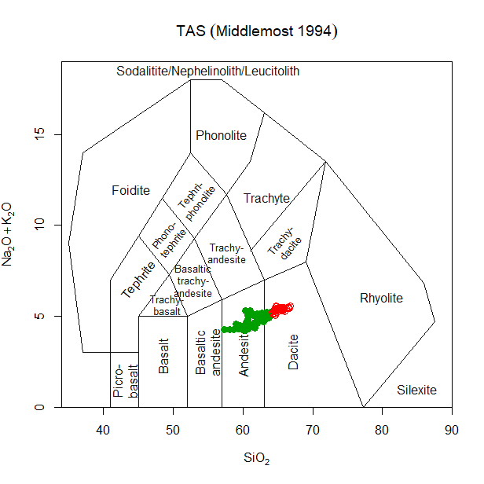

<!-- README.md is generated from README.Rmd. Please edit that file -->

```{r, include = FALSE}
knitr::opts_chunk$set(
  collapse = TRUE,
  comment = "#>",
  fig.path = "man/figures/README-",
  out.width = "100%"
)
```

# graphTemplates

<!-- badges: start -->

<!-- badges: end -->

graphTemplates allows to define templates for R graphs, using json -- a human readable format (for certain values of "human"). These templates are primarily meant to be used with GCDkit (<http://gcdkit.org>), although the aim is to also supply parsers to use them in ggplot.

See more examples in `/extra/demo_script`

## Installation

The easiest way to install graphTemplates is directly from github:

``` r
devtools::install_github("jfmoyen/graphTemplates")
```

alternately, download the zip or gz archive from the "release" section and install with e.g.

``` r
install.packages("graphTemplates_0.1.zip",repo=NULL
```

However, the github version is more likely to be up to date.

***NB: GCDkit requires R \<= 4.1, so if you use a newer version, GCDkit will fail. What the package will do in this case is uncertain.***

## Example

### Loading and preparing a template

```{r}
library(tidyverse)
library(GCDkit)
library(graphTemplates)

 data("atacazo")
 accessVar("atacazo")
```

A template is loaded as follows:

```{r}
tt <- parseJsonTemplate("TAS.json")
```

Options can be used at template loading:

```{r}
ttr <- parseJsonTemplate("Cabanis",template_options=c(showText=F))
```

Templates can be manipulated to a point after creation. This is in particular needed for ternary plots, to create the triangle etc:

```{r}
ttr <- addTernaryOrnaments(ttr)
```

### Using GCDkit/Figaro

In a GCDkit context, a template can then be plotted using Figaro:

```{r}
plotFigaro(tt,WR,labels)
```

or even

```{r}
plotFigaro(ttr)
```

### Using ggplot

In ggplot, a similar function is provided:

```{r}
plotgg(tt)
plotgg(ttr)
```

It is however more flexible to use a lower level interface:

```{r}
tt<-parseJsonTemplate("TAS")
ttg<-graph_template(tt)
ggplot()+ttg # a blank plot

ggplot()+ttg + theme_gcdkit() # A blank plot with a nicer theme

ggplot()+
  ttg+
  theme_gcdkit()+
  geom_point(data=atacazo,aes(x=SiO2,y=Na2O+K2O)) # Some data
```

Of course in this case the user must take care of his own aesthetics...

### GCDkit emulation

Lastly, file extra/GCDkit_connector supplies an emulation of `GCDkit::plotDiagram()` :

```{r}
 # source /extra/GCDkit_connector.R


# plotDiagram.json("TASMiddlemostVolc.json")
```



## Templates

Templates are defined as json files. For a more or less complete description of the format, `?jsonDiagramFormat`.

## Technicities

The normal workflow is the following:

-   Read a template from the json file, together with some user-specified options (parse_template_fromjson). This returns a graphTemplate object. The parser combines json instructions with user input to modify or remove some elements.

-   Modify it if needed, e.g. by adding ternary axes, but this is also the place where most components can be altered.

-   Plot it, either

    -   In figaro: pass to Figaro and convert into a Figaro template

    -   in ggplot (to do).

Thus, there are two main components: a parser, that reads a json file and returns a graphTemplate; and one (or several) plotters, that operate on a graphTemplate obejct.

For instance:

``` r
# Load a template from its json file
tt <- parse_template_fromjson("Cabanis",template_options=c(showText=F),
                              style_options=c(arrowwidth=3))
# Modify the template                              
tt <- addTernaryAxes(tt)
# Plot, in this case using globally-defined WR and labels as per GCDkit convention.
plotFigaro(tt,WR,labels)
```

This workflow is wrapped in plotDiagram_json, that interprets GCDkit's options (and emulates plotDiagram).

This package defines two (S3) classes – graphTemplate, and templateElement. Most functions operate on these classes.

### graphTemplate

The class graphTemplate is the core of the package. It is described in ?graphTemplate, and has a print method that gives some information. It is essentially a list of elements - the main one is template, itself a list of templateElement.

A graphTemplate is generated from a json file (and user options) by the *parser*. Nothing stops you from defining it manually, or from any other source.

It can be manipulated as a list, using normal R syntax; or through helper functions such as addTernaryAxes (adds pseudo-axes to draw the triangle of a ternary plot).

Finally, one or several plotter(s) (for the moment there is only one plotter, a figaro plotter) interpret the template and combine it with data to plot the actual graph.

### templateElement

The class templateElement holds the information for one single element: a line, or a text item (the most commonly encountered). Such elements can be processed by Figaro. They are lists, with components depending on their actual type.

templateElements hold graphical information (colour, line type...). They can be formatted, during parsing, using json fields and well as user options – see ?jsonDiagramFormat and ?templateElement.

## Experimental support for plates

Plates (as used in GCDkit) are included in version 0.3. Since the plate templates have not been developped yet, the plate routines have not been fully debugged and should be regarded as experimental, at best.

<!-- devtools::build_readme() -->
