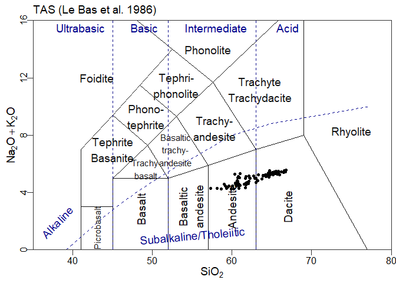

<!-- README.md is generated from README.Rmd. Please edit that file -->

# graphTemplates

<!-- badges: start -->
<!-- badges: end -->

graphTemplates allows to define templates for R graphs, using json – a
human readable format (for certain values of “human”). These templates
are primarily meant to be used with GCDkit (<http://gcdkit.org>),
although the aim is to also supply parsers to use them in ggplot.

See more examples in `/extra/demo_script`

## Installation

The easiest way to install graphTemplates is directly from github:

``` r
devtools::install_github("jfmoyen/graphTemplates")
```

alternately, download the zip or gz archive from the “release” section
and install with e.g.

``` r
install.packages("graphTemplates_0.1.zip",repo=NULL
```

However, the github version is more likely to be up to date.

***NB: GCDkit requires R \<= 4.1, so if you use a newer version, GCDkit
will fail. What the package will do in this case is uncertain.***

## Example

### Loading and preparing a template

``` r
library(tidyverse)
#> -- Attaching core tidyverse packages ------------------------ tidyverse 2.0.0 --
#> v dplyr     1.1.4     v readr     2.1.5
#> v forcats   1.0.0     v stringr   1.5.1
#> v ggplot2   3.5.1     v tibble    3.2.1
#> v lubridate 1.9.3     v tidyr     1.3.1
#> v purrr     1.0.2     
#> -- Conflicts ------------------------------------------ tidyverse_conflicts() --
#> x dplyr::filter() masks stats::filter()
#> x dplyr::lag()    masks stats::lag()
#> i Use the conflicted package (<http://conflicted.r-lib.org/>) to force all conflicts to become errors
```

``` r
library(GCDkit)
#> Le chargement a nécessité le package : tcltk
#> Patching.... please wait
#> Entering the normal mode...
#> 
#> Initializing the EarthChem interface....
#> R proxy:  
#> System proxy:
#> Le chargement a nécessité le package : XML
#> Windows version: Windows 10 x64 (build 22631)
#> R version: x86_64-w64-mingw324.1.3
#> 
#> Geochemical Data Toolkit (GCDkit) 6.2.0,
#> built R 4.1.3; ; 2024-01-12 15:07:53 UTC; windows
#> 
#> Please support our efforts and cite the package 'GCDkit' in publications
#> using the reference below. Type 'citation("GCDkit")' for BibTex version.
#> ================================================================================
#> Vojtech Janousek, Colin M. Farrow and Vojtech Erban (2006).
#> Interpretation of whole-rock geochemical data in igneous geochemistry:
#> introducing Geochemical Data Toolkit (GCDkit).
#> Journal of Petrology 47(6): 1255-1259.
#> doi: 10.1093/petrology/egl013
#> ================================================================================
#> 
#> GUI: None.
#> Ready 2 Go - Enjoy!
#> 
#> Attachement du package : 'GCDkit'
#> 
#> L'objet suivant est masqué depuis 'package:ggplot2':
#> 
#>     annotate
#> 
#> L'objet suivant est masqué depuis 'package:graphics':
#> 
#>     plot.default
```

``` r
library(graphTemplates)
#> Reading template helpers..
#> sourcing R_template_functions/dataTransform.R ...ok
#> sourcing R_template_functions/GCDkit_additions.R ...ok
#> sourcing R_template_functions/hooks.R ...ok
#> ..done
```

``` r

 data("atacazo")
 accessVar("atacazo")
#> R data 
#> .........
#> Le chargement a nécessité le package : lattice
#> 
#>         Age (Ma) 87Sr/86Sri 143Nd/144Ndi EpsNdi   TDM TDM.Gold TDM.2stg
#> ATAC-4       0.1   0.704257     0.512854   4.21 0.668    0.723    0.458
#> ATAC-5       0.1   0.704340     0.512864   4.41 0.541    0.578    0.443
#> ATAC-16      0.1   0.704181     0.512873   4.58 0.639    0.693    0.429
#> ATAC-20      0.1   0.704223     0.512862   4.37 0.501    0.532    0.446
#> ATAC-23      0.1   0.704221     0.512858   4.29 0.490    0.520    0.452
#> ATAC-24      0.1   0.704096     0.512887   4.86 0.569    0.613    0.407
#> ATAC-27      0.1   0.704347     0.512834   3.82 0.713    0.772    0.489
#> ATAC-29      0.1   0.704372     0.512820   3.55 0.824    0.900    0.510
#> ATAC-35      0.1         NA     0.512828   3.71 0.679    0.732    0.498
#> ATAC-40      0.1   0.704313     0.512828   3.71 0.630    0.674    0.498
#> ATAC-46      0.1   0.704270     0.512852   4.18 0.635    0.684    0.461
#> ATAC-50      0.1         NA     0.512882   4.76 0.572    0.617    0.415
#> ATAC-56      0.1   0.704281     0.512845   4.04 0.543    0.578    0.472
#> NINA-1       0.1   0.704280     0.512853   4.19 0.646    0.697    0.460
#> NINA-2       0.1   0.704165     0.512886   4.84 0.546    0.587    0.409
#> NINA-7       0.1   0.704166     0.512888   4.88 0.516    0.553    0.406
#> NINA-22      0.1   0.704155     0.512885   4.82 0.496    0.529    0.410
#> NINA-27      0.1         NA     0.512840   3.94 0.575    0.614    0.480
#> NINA-34      0.1   0.704204     0.512894   4.99 0.565    0.610    0.396
#> NINA-37      0.1   0.704190     0.512880   4.72 0.596    0.643    0.418
#> NINA-47      0.1   0.704272     0.512840   3.94 0.583    0.623    0.480
#> NINA-49      0.1   0.704291     0.512889   4.90 0.589    0.638    0.404
#> NINA-52      0.1   0.704250     0.512890   4.92 0.566    0.610    0.403
#> NINA-53      0.1   0.704318     0.512880   4.72 0.482    0.513    0.418
#> WARNING: Skipping: Not sufficent REE data present!  
#> Processing...Please wait...
#> Identifying the data types present...
#> Major elements
#> ......... done!
#> Trace elements 
#> ......... done!
#> Sr and/or Nd isotopes
#> ......... done!
#> Available datasets:
#> [1] "atacazo"
```

A template is loaded as follows:

``` r
tt <- parseJsonTemplate("TAS.json")
```

Options can be used at template loading:

``` r
ttr <- parseJsonTemplate("Cabanis",template_options=c(showText=F))
```

Templates can be manipulated to a point after creation. This is in
particular needed for ternary plots, to create the triangle etc:

``` r
ttr <- addTernaryOrnaments(ttr)
```

### Using GCDkit/Figaro

In a GCDkit context, a template can then be plotted using Figaro:

``` r
plotFigaro(tt,WR,labels)
```


or even

``` r
plotFigaro(ttr)
```


### Using ggplot

In ggplot, a similar function is provided:

``` r
plotgg(tt)
#> WARNING: graphical elements of type NULL are not implemented yet. Dropping.
#> WARNING: graphical elements of type NULL are not implemented yet. Dropping.
```


``` r
plotgg(ttr)
#> WARNING: graphical elements of type NULL are not implemented yet. Dropping.
```


It is however more flexible to use a lower level interface:

``` r
tt<-parseJsonTemplate("TAS")
ttg<-graph_template(tt)
#> WARNING: graphical elements of type NULL are not implemented yet. Dropping.
#> WARNING: graphical elements of type NULL are not implemented yet. Dropping.
```

``` r
ggplot()+ttg # a blank plot
```


``` r

ggplot()+ttg + theme_gcdkit() # A blank plot with a nicer theme
```


``` r

ggplot()+
  ttg+
  theme_gcdkit()+
  geom_point(data=atacazo,aes(x=SiO2,y=Na2O+K2O)) # Some data
```



Of course in this case the user must take care of his own aesthetics…

### GCDkit emulation

Lastly, file extra/GCDkit_connector supplies an emulation of
`GCDkit::plotDiagram()` :

``` r
 # source /extra/GCDkit_connector.R


# plotDiagram.json("TASMiddlemostVolc.json")
```


## Templates

Templates are defined as json files. For a more or less complete
description of the format, `?jsonDiagramFormat`.

## Technicities

The normal workflow is the following:

- Read a template from the json file, together with some user-specified
  options (parse_template_fromjson). This returns a graphTemplate
  object. The parser combines json instructions with user input to
  modify or remove some elements.

- Modify it if needed, e.g. by adding ternary axes, but this is also the
  place where most components can be altered.

- Plot it, either

  - In figaro: pass to Figaro and convert into a Figaro template

  - in ggplot (to do).

Thus, there are two main components: a parser, that reads a json file
and returns a graphTemplate; and one (or several) plotters, that operate
on a graphTemplate obejct.

For instance:

``` r
# Load a template from its json file
tt <- parse_template_fromjson("Cabanis",template_options=c(showText=F),
                              style_options=c(arrowwidth=3))
# Modify the template                              
tt <- addTernaryAxes(tt)
# Plot, in this case using globally-defined WR and labels as per GCDkit convention.
plotFigaro(tt,WR,labels)
```

This workflow is wrapped in plotDiagram_json, that interprets GCDkit’s
options (and emulates plotDiagram).

This package defines two (S3) classes – graphTemplate, and
templateElement. Most functions operate on these classes.

### graphTemplate

The class graphTemplate is the core of the package. It is described in
?graphTemplate, and has a print method that gives some information. It
is essentially a list of elements - the main one is template, itself a
list of templateElement.

A graphTemplate is generated from a json file (and user options) by the
*parser*. Nothing stops you from defining it manually, or from any other
source.

It can be manipulated as a list, using normal R syntax; or through
helper functions such as addTernaryAxes (adds pseudo-axes to draw the
triangle of a ternary plot).

Finally, one or several plotter(s) (for the moment there is only one
plotter, a figaro plotter) interpret the template and combine it with
data to plot the actual graph.

### templateElement

The class templateElement holds the information for one single element:
a line, or a text item (the most commonly encountered). Such elements
can be processed by Figaro. They are lists, with components depending on
their actual type.

templateElements hold graphical information (colour, line type…). They
can be formatted, during parsing, using json fields and well as user
options – see ?jsonDiagramFormat and ?templateElement.

## Experimental support for plates

Plates (as used in GCDkit) are included in version 0.3. Since the plate
templates have not been developped yet, the plate routines have not been
fully debugged and should be regarded as experimental, at best.

<!-- devtools::build_readme() -->
